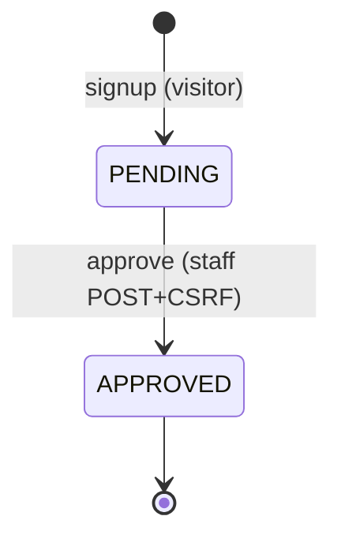
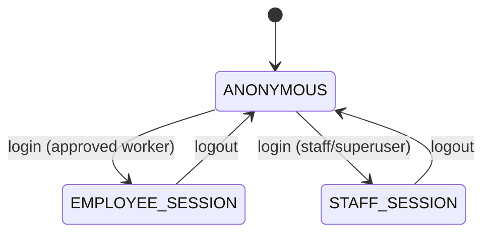
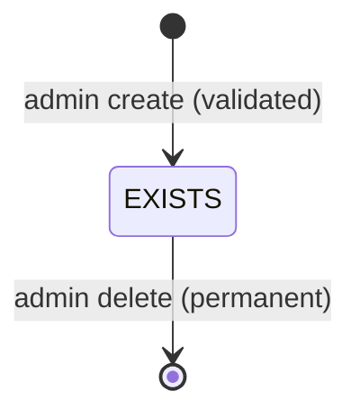
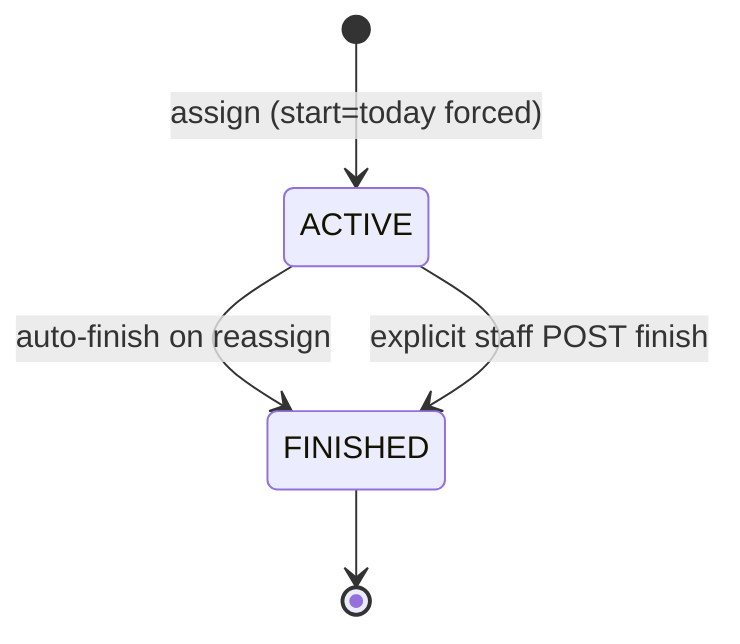
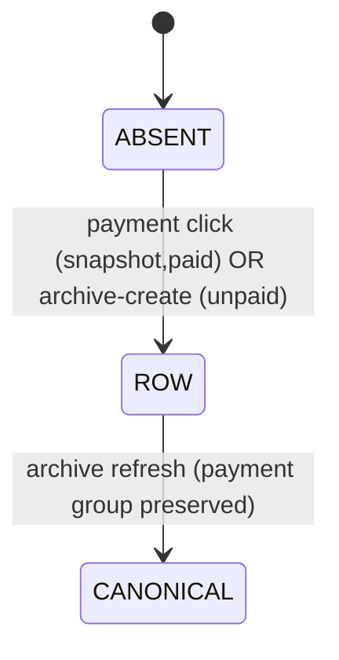
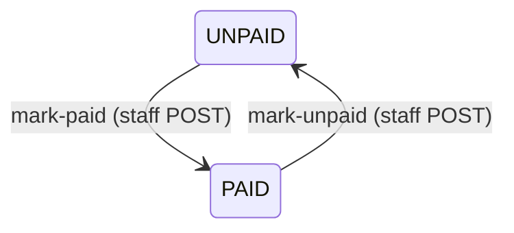
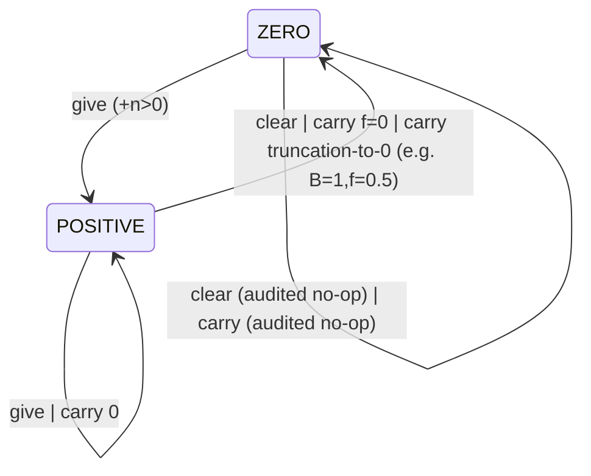
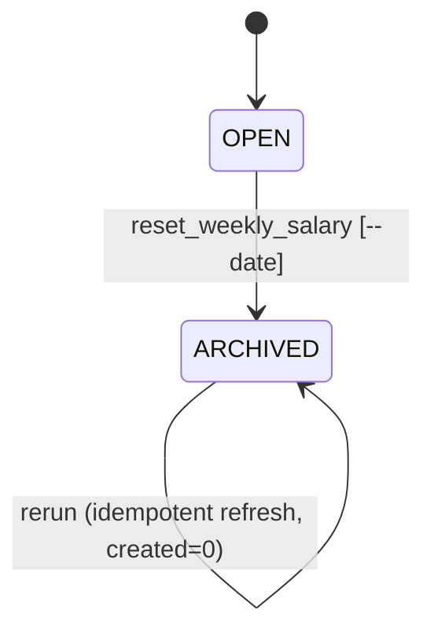

# Phase 6.5 — Management-V1 State-Machine Extraction

> **⚠ SUPERSEDED WORKING DRAFT — DO NOT CITE.**
> The authoritative Phase 6.5 deliverable is **`05_STATE_MACHINE_SPECIFICATION.md`** (+ `STATE_TRANSITION_MATRIX.md`, `STATE_MACHINE_TEST_MATRIX.md`, `STATE_MACHINE_OPEN_QUESTIONS.md`).
> This earlier draft uses a DIFFERENT internal SM-numbering (e.g., its SM-06 = payment ledger; the final spec's SM-06/07 = pagdi/warp). Cross-phase ID mapping in the final spec governs. Retained only for traceability of the extraction process.

Perspective: externally observable + code-verified state behavior of the external application (serverloom), for later reproduction inside Management-V1. This document describes WHAT the external application does — architecture mapping comes later. Inputs: Phases 6.1–6.4 deliverables (authoritative), source code, runtime evidence from Phases 4/4.5, and targeted re-verification performed this session.

Evidence keys: V=`accounts/views.py` · S=`core/services.py` · M=`core/models.py` · CR/CC=management commands · TS/TA=test modules · R45=Phase 4.5 report · P4=Phase 4 report · C64=`04_CALCULATION_SPECIFICATION.md` · BR6.3=`BUSINESS_RULE_INVENTORY.md`.

Verification labels (never mixed): RUNTIME-VERIFIED (executed/proven, incl. this session) · CODE-CONFIRMED (exact path traced) · DATABASE-CONFIRMED (constraint/migration read) · INFERRED (argued; flagged) · NOT VERIFIED · BUSINESS DECISION REQUIRED.

---

## 1. Scope & Method

Every entity with multiple meaningful lifecycle conditions was inventoried regardless of field naming. Detection questions (§4 of the master prompt) were applied to every model, nullable date/flag/FK, existence pattern, and command. Transitions were traced UI→route→service→DB→audit→resulting state. Calculations are referenced by CALC-IDs (C64), not duplicated.

## 2. Stateful Entity Inventory

| Entity | Persisted state carrier | Machine? | Machine ID |
| ------ | ---------------------- | -------- | ---------- |
| Worker account approval | Employee.is_approved bool | YES | SM-01 |
| HTTP session / role class | Django session + user flags | YES | SM-02 |
| Production entry (SareeCount row) | row existence (+ unique employee,date) | YES (existence machine) | SM-03 |
| Pagdi assignment | PagdiHistory.end_date NULL/not-null | YES | SM-04 |
| Warp assignment | WarpHistory.end_date NULL/not-null | YES | SM-05 |
| Weekly ledger ROW (SalaryHistory) | row existence + quantity group | YES (existence/canonicalization) | SM-06 |
| Payment flag on ledger row | paid_status bool + paid_date | YES (reversible flag machine on SM-06 rows) | SM-07 |
| Advance balance | Employee.advance_salary scalar | YES (value-state machine) | SM-08 |
| Business week lifecycle | DERIVED: existence of SalaryHistory rows for window (NO Week table) | YES (implicit/computed) | SM-09 |
| Vestigial live counter | Employee.current_week_salary | YES (legacy, zero/nonzero) | SM-10 |
| Django User.is_active | auth flag | IMPLICIT gate only (see §16-2) | (folded into SM-01/02 notes) |
| AdvanceHistory / PagdiChangeHistory / WarpChangeHistory | append-only event rows | NO states — immutable log | §3 non-machines |
| AlertEmail registry | static unique emails | NO lifecycle (inert; D-09 open) | §3 non-machines |
| Rate value, capacity value, notes, profile fields | continuous attributes | NO (parameter changes, not states) | §3 non-machines |
| Notifications / background jobs / file uploads | none exist | NO | — |

Machine index vs Phase 6.3 IDs: SM-01≡STATE-001 · SM-02≡STATE-008 · SM-03≡STATE-003 · SM-04≡STATE-004 · SM-05≡STATE-005 · SM-06+SM-07≡STATE-006 (6.3 combined them; split here into row-existence and payment-flag machines) · SM-08≡STATE-007 · SM-09≡STATE-002 · STATE-009 remains a NON-EXISTENT proposal (D-01). No ID conflicts; transition IDs TR-* are new series.

## 3. Machines SM-01 … SM-10

### SM-01 — Worker Account Approval

States:
- **S1 PENDING** — meaning: identity exists, unusable for login. Representation: `Employee.is_approved=False` (default at creation). Entry: successful signup (TR-ACC-001). Observable: appears in admin pending count/list; login refused without session ("Account not approved yet."). Modifiable by: Staff only. Evidence V:50-57,77-79; RUNTIME-VERIFIED (P4 §6).
- **S2 APPROVED** — meaning: full worker; eligible for pickers/materials/pay. Representation: `is_approved=True`. Entry: TR-ACC-002. Observable: dashboard access, picker membership. Exit: NONE in-app (terminal app-scoped; §8).



Transitions:
- **TR-ACC-001 · SIGNUP-CREATE** `[none]→PENDING` — Trigger: POST /accounts/signup/. Actor: Anonymous visitor. Validations: all fields present; phone unique (else inline error, no state change). DB: creates User(username=phone)+Employee(rate 0,balance 0,approved=False) atomically-enough (two inserts; failure between them leaves orphan User — no transaction wrapper; CODE-CONFIRMED residual, benign: duplicate-phone guard prevents retry success; M-V1 should wrap). Side effects: redirect+flash. Audit: NONE (gap AUD6.3-008). Calc effect: none until approval. UI: login page confirmation. Reversible: deletion only via super-admin CASCADE. Concurrency: check-then-insert on phone; unique username backstop (DUP-1 BR6.3). Failure: friendly errors only. Evidence V:37-60. Level: RUNTIME-VERIFIED.
- **TR-ACC-002 · APPROVE** `PENDING→APPROVED` — Trigger: POST /panel/employees/<id>/approve/ (+CSRF). Actor: Staff. Preconditions: staff session; target exists (404 otherwise). Validation: method GET→400 "POST only"; tokenless POST→403. DB: `is_approved=True` update_fields. Side effects: success flash. Audit: NONE (gap). Calc/permission effect: unlocks eligibility (BR6.3 BR-005), login gate (BR-022). UI: row leaves pending list. Reversible: NO in-app path. Concurrency: idempotent boolean flip; concurrent identical flips benign last-write-same-value — CODE-CONFIRMED analysis; simultaneous-pair test NOT VERIFIED. Failure: 404 unknown id; 400/403 method/token. Evidence V:796-810; TS ApprovalSecurityTests ×4. Level: RUNTIME-VERIFIED.
- Invalid transitions: APPROVED→APPROVED repeat = allowed no-op success (RUNTIME idempotent test); APPROVED→PENDING = NO PATH (SECURELY BLOCKED by absence; super-admin could uncheck out-of-app unaudited); anonymous/self approve = DENY (302/403); GET approve = BLOCKED WITH ERROR 400.

### SM-02 — Session / Role-Class Machine

States (session-scoped, not persisted server-side beyond framework session):
- **ANONYMOUS** — no authenticated user. Entry: pre-login or logout. Behavior: protected routes →302 login (`next` preserved).
- **EMPLOYEE-SESSION** — authenticated approved worker. Entry TR-SES-001. Behavior: /employee/* surfaces only.
- **STAFF-SESSION** — is_staff or is_superuser. Entry TR-SES-002. Behavior: /panel/* + super-admin /admin/.
Guards (refusals issue NO session): unapproved worker login; wrong credentials (generic message — SEC-006); authenticated non-staff non-employee user ("Unauthorized account."); INACTIVE User (is_active=False) fails authenticate() with the SAME generic credential error — implicit disabled-account lever existing purely out-of-app (framework semantics CODE-CONFIRMED; Django stock ModelBackend).



Transitions: **TR-SES-001/002 LOGIN** (manual; guards above; role-routed landing dashboard/panel; writes legacy unused `session["employee_id"]`) — RUNTIME-VERIFIED matrix P4 §6. **TR-SES-003 LOGOUT** any→ANONYMOUS (immediate; post-logout protected hit→login; repeat-safe) — RUNTIME-VERIFIED. Invalid: employee credentials→panel surface = DENY (redirect); direct-URL with no session = 302; cross-role URL = bounce. No expiry behavior configured beyond framework defaults — NOT VERIFIED (no config found).

### SM-03 — Production Entry Existence

States: **ABSENT** (no row) ⇄ **EXISTS** (row with unique (employee,date)). No intermediate states; creation is single INSERT.



Transitions:
- **TR-PRO-001 CREATE** `ABSENT→EXISTS` — Actor Staff. Two entry points (global form / detail form) = one capability. Validations VAL6.3-003/004 (date ISO/blank→today; int ≥0). DB: INSERT guarded by savepoint; unique(employee,date) DATABASE-CONFIRMED backstop. Duplicate attempt → BLOCKED WITH ERROR friendly flash, zero mutation, race-proven (3-way parallel single row). Audit: NONE (gap AUD-006). Calc effect: feeds CALC-002 Q and CALC-003 M at next read (C64 §7). Failure: friendly messages only (500-class eliminated). Level: RUNTIME-VERIFIED.
- **TR-PRO-002 DELETE** `EXISTS→ABSENT` — Actor Staff via detail page. Permanent hard delete; NO tombstone. Missing/duplicate-deleted id → explicit "Entry not found." failure (false-success bug fixed). Audit: NONE (gap). Calc effect: live aggregates drop it instantly; ARCHIVED-week ledger snapshots do NOT follow (drift risk C-02/D-02). Deletion of archived-week rows IS possible (no week-state guard) — documented behavioral consequence. Level: RUNTIME-VERIFIED (delete/nonexistent tests).
- Invalid: EDIT-IN-PLACE = NO PATH anywhere (absence-verified); same-day second insert = blocked-with-error; delete nonexistent = blocked-with-explicit-failure; unapproved-worker entry via global form = picker-level block (detail-path exception documented BR6.3 BR-005).

### SM-04 — Pagdi Assignment

States: **ACTIVE** (`end_date IS NULL`) / **FINISHED** (`end_date=today-at-finish-moment`). Creation is instantaneous inside the assignment transaction — there is NO observable CREATED-before-ACTIVE state.

```mermaid
stateDiagram-v2
    [*] --> ACTIVE: assign (staff; atomic auto-finish of open ones)
    ACTIVE --> FINISHED: auto-finish on new assignment (ONLY in-app path)
    FINISHED --> [*]
```

Transitions:
- **TR-PAG-001 ASSIGN** `[none or all-FINISHED]→ACTIVE` — Actor Staff. Validations: capacity int≥0; start_date REQUIRED ISO; worker id must resolve (friendly rejections). DB (ONE locked transaction): lock employee row → lock open pagdis → finish each (TR-PAG-002 fires per open pagdi) → INSERT new ACTIVE → PagdiChangeHistory CREATE audit. Eligibility: approved-only picker. Audit: CREATE ✓ (capacities/actor/name snapshot). Calc effect: new σ_a resets CALC-003 window. Failure: whole-tx rollback; Employee.DoesNotExist → friendly flash. Concurrency: employee-row lock serializes assigners; 5-way parallel → exactly ONE ACTIVE, losers rolled back clean — RUNTIME-VERIFIED. Level: RUNTIME-VERIFIED.
- **TR-PAG-002 AUTO-FINISH** `ACTIVE→FINISHED` — Automatic (inside TR-PAG-001 transaction), note "Auto-finish due to new assignment"; PagdiChangeHistory FINISH w/ previous/new end dates. Sets end_date=today ⇒ freezes CALC-003 upper bound permanently. Not independently invocable in-app. Level: RUNTIME-VERIFIED (audit-chain checks).
- Invalid: FINISHED→ACTIVE reopen = NO in-app path (super-admin can null end_date UNAUDITED out-of-band — documented, not a feature); explicit finish control = DOES NOT EXIST (gap G-05/D-05 BUSINESS DECISION REQUIRED); employee self-finish POST branch exists but unreachable (inert — if POSTed with active pagdi it WOULD finish; with none it silently renders page — CODE-CONFIRMED inert detail).
- Terminal: FINISHED is terminal in-app (§8). Super-admin DELETE possible; audit survives (SET_NULL+snapshot).

### SM-05 — Warp Assignment

Same skeleton as SM-04 with verified differences: start_date FORCED to today (no input); explicit finish control exists.



Transitions: **TR-WAR-001 ASSIGN** (=TR-PAG-001 mechanics; capacity label differs; WarpChangeHistory CREATE) — RUNTIME-VERIFIED. **TR-WAR-002 AUTO-FINISH** on reassign — RUNTIME-VERIFIED. **TR-WAR-003 EXPLICIT FINISH** `ACTIVE→FINISHED` — POST /panel/warp/<id>/finish/ only; GET→400; already-finished target → friendly info "Warp was already finished." (idempotent outcome, NO second transition); FINISH audited. RUNTIME-VERIFIED (TS ×4 incl. GET rejection).
Invalid: refinish POST on finished warp = SILENT NO-OP WITH INFO MESSAGE (verified); FINISHED→ACTIVE reopen = none in-app; concurrency NOTE (new analysis): two simultaneous finish POSTs both pass the pre-lock is_active() read → serialize on row lock → both set end_date=today AND BOTH WRITE FINISH AUDITS (duplicate-audit possibility; state converges; no corruption) — CODE-CONFIRMED analysis, runtime pair NOT VERIFIED.

### SM-06 — Weekly Ledger Row (existence + canonicalization)

One SalaryHistory row per (worker, week) — DATABASE-CONFIRMED unique(employee,week_start,week_end). States by existence + quantity freshness:
- **ABSENT** — no row exists.
- **ROW** — row exists; quantities may be a click-time snapshot (possibly stale) until canonicalized. Payment sub-state tracked separately in SM-07.
- **CANONICAL** — archive has run for that window: the FIVE quantity fields are end-of-week truth (C64 CALC-007).



Transitions:
- **TR-LED-001 ARCHIVE-CREATE** `ABSENT→ROW(unpaid)` — System/operator CLI within CALC-007; paid_status=False seeded; notes per --note. RUNTIME-VERIFIED.
- **TR-LED-002 CLICK-CREATE** `ABSENT→ROW(paid snapshot)` — Staff mark-paid when no row exists; stores click-time quantities (C64 §20 CREATE PATH); get_or_create + unique backstop. RUNTIME-VERIFIED.
- **TR-LED-003 CANONICALIZE** `ROW→CANONICAL` — operator archive refresh of exactly {sarees, salary_rate, gross, advance-copy, final}; payment group byte-preserved (INV6.4-05); idempotent rerun created=0. NOT a payment-state change. RUNTIME-VERIFIED.
- Invalid: second row same week = blocked by unique constraint (race-bounded); in-app edit of CANONICAL quantities = NO PATH; super-admin arbitrary edits possible out-of-band (documented, unaudited).

### SM-07 — Payment Flag (on SM-06 rows)

States: **UNPAID** (flag False, or row absent) / **PAID** (True + paid_date=today-at-click). Scope: endpoints compute bounds from TODAY ⇒ current week only.



Transitions:
- **TR-PAY-001 MARK-PAID** `UNPAID→PAID` — Staff; POST+CSRF (GET→400); unknown id → clean 404; two distinct paths (C64 §20). Repeats converge to one row. Audit: NONE (req AUD6.3-007). RUNTIME-VERIFIED.
- **TR-PAY-002 MARK-UNPAID** `PAID→UNPAID` — reversible FLAGS-ONLY flip (paid_date→NULL; quantities untouched); absent-row case → SILENT NO-OP with success flash (benign asymmetry BR6.3 BR-032). Audit: NONE. RUNTIME-VERIFIED.
- Invalid: past/future-week flips via app = structurally IMPOSSIBLE (bounds always from today; policy D-03 OPEN for M-V1); mark-paid rewriting quantities of an existing row = BLOCKED BY CODE (authority split INV6.4-07); tokenless POST = 403.

### SM-08 — Advance Balance

Value-states: **ZERO** / **POSITIVE** (scalar ≥0; magnitude is continuous, not stateful).



Transitions (all TRANSACTIONAL, employee-row locked, audited before/after/actor/note):
- **TR-ADV-001 GIVE** `*→POSITIVE(+n)` — additive; amount int>0 else friendly reject; parallel gives serialize exactly (RUNTIME 70+70=140). FORGED-ID RESIDUAL: nonexistent integer emp_id raises Employee.DoesNotExist uncaught (view catches ValueError only) → HTTP 500 — NEW finding **OBS-SM-01**, severity LOW (staff-only, authenticated, CSRF-protected; ugly failure; zero corruption; sibling id-routes return clean 404 via get_object_or_404). Management-V1 implication: must return clean 404. Level: CODE-CONFIRMED this session.
- **TR-ADV-002 CLEAR** `POSITIVE→ZERO` / `ZERO→ZERO` deliberate audited no-op — sets 0; ALWAYS audits incl. no-op. Same OBS-SM-01 forged-id residual. RUNTIME-VERIFIED.
- **TR-ADV-003 CARRY** `POSITIVE→T(B×f) clamp≥0` possibly landing ZERO (f=0 wipe or truncation, e.g. B=1,f=0.5→0) / `ZERO→ZERO` audited no-op — operator CLI only; whole-run transaction; write-if-changed but audit-ALWAYS; NON-IDEMPOTENT f≠1 (compounds); CLI runs record NULL actor. RUNTIME-VERIFIED (K-series; py-verify semantics).
- Invalid: amount ≤0 → BLOCKED WITH ERROR (flash); balance edits outside {give,clear,carry} = NO PATH in-app (super-admin out-of-band unaudited); carry referencing absent worker → DoesNotExist propagates at command level ⇒ whole-run abort rc≠0 with atomic rollback (INFERRED standard Django-command behavior — exception path not separately executed).

### SM-09 — Business Week Lifecycle (implicit / computed)

NO Week table exists. State is DERIVED from the computed current window vs existence/canonicality of SalaryHistory rows:
- **OPEN** — a window without canonical rows; all inputs mutable.
- **ARCHIVED** — CALC-007 has executed for that window; its quantity fields are canonical.



Transitions:
- **TR-WEK-001 ARCHIVE** `OPEN→ARCHIVED` — MANUAL OPERATOR command ONLY (panel has no control; nothing scheduled). Whole-run transaction; dry-run predicts counts. SYSTEM-GENERATED ledger rows inside. RUNTIME-VERIFIED.
- **TR-WEK-002 RERUN** `ARCHIVED→ARCHIVED` — numeric no-op refresh; safe retry contract. RUNTIME-VERIFIED.
- Week ROLLOVER (midnight): TIME-BASED shift of WHICH window is "current" (CALC-001 d*) — performs NO storage transition and archives NOTHING (absence verified). Unarchived past windows remain OPEN indefinitely until --date run.
- Invalid/reversal: ARCHIVED→OPEN = NO PATH anywhere (irreversible; §8); UI-triggered archive = DOES NOT EXIST.

### SM-10 — Vestigial Live Counter (legacy)

Employee.current_week_salary: **ZERO** ⇄ **NONZERO**. Sole writer: archive zeroing; no code path ever increments it (deprecated field, BUG-21/R-12). Transition TR-CSW-001 NONZERO→ZERO inside CALC-007. Legacy compatibility only — Management-V1 recommendation: DO NOT PORT (BR6.3 BR-034). Diagram omitted.

## 4. Automatic vs Manual Classification

| Transition | Class |
| ---------- | ----- |
| TR-ACC-001 signup | MANUAL action; SYSTEM-GENERATED records (visitor-triggered) |
| TR-ACC-002 approve | MANUAL (POST+CSRF enforced) |
| TR-SES-001..003 login/logout | MANUAL |
| TR-PRO-001 CREATE / TR-PRO-002 DELETE | MANUAL |
| TR-PAG-001 / TR-WAR-001 assign | MANUAL trigger; TRANSACTIONAL MIXED (embedded auto-finish step is AUTOMATIC within the same transaction) |
| TR-PAG-002 auto-finish | AUTOMATIC (transactional side-effect of assignment) |
| TR-WAR-002 auto-finish | AUTOMATIC; TR-WAR-003 explicit finish MANUAL |
| TR-LED-001 archive-create | SYSTEM-GENERATED via MANUAL operator command |
| TR-LED-002 click-create | MANUAL |
| TR-LED-003 canonicalize | SYSTEM-GENERATED within operator command |
| TR-PAY-001/002 | MANUAL |
| TR-ADV-001/002 give/clear | MANUAL |
| TR-ADV-003 carry | MANUAL operator command (never time-based) |
| TR-WEK-001/002 archive/rerun | MANUAL OPERATOR (NOT time-based) |
| Current-window shift at midnight | TIME-BASED (computed context only — zero entity mutation) |
| Duplicate/range blocks | DATABASE-ENFORCED backstops (unique(employee,date); unique(ledger week); CHECK positivity) |

## 5. Actor / Permission Matrix

Staff ≡ Admin in this application (`_is_staff` = is_staff OR is_superuser — one privileged class; V:27-31). Super-admin column = Django /admin/ out-of-app surface. n/a = surface does not exist for that actor context.

| Transition | Anonymous | Employee | Staff/Admin | System(CLI) | Super-admin |
| ---------- | --------- | -------- | ----------- | ----------- | ----------- |
| Signup create PENDING (TR-ACC-001) | ALLOW | — | — | — | — |
| Approve (TR-ACC-002) | DENY 302/403 | DENY | ALLOW | — | ALLOW (unchecked edit) |
| Login role entry (TR-SES-001/002) | ALLOW valid creds only | self | self | — | self |
| Logout (TR-SES-003) | session owner | ALLOW | ALLOW | — | — |
| Production CREATE/DELETE (TR-PRO-*) | DENY | DENY (no write route exists) | ALLOW | — | ALLOW |
| Pagdi/Warp ASSIGN (+auto-finish) | DENY | DENY | ALLOW | — | ALLOW |
| Warp explicit FINISH | DENY 400 | DENY (staff-gated route) | ALLOW | — | ALLOW |
| Ledger CLICK-CREATE / PAID / UNPAID | DENY | DENY | ALLOW | — | ALLOW |
| ARCHIVE run/rerun/dry-run | — | — | DENY-by-absence (no panel control) | ALLOW | ALLOW (shell) |
| GIVE/CLEAR advance | DENY | DENY | ALLOW | — | ALLOW |
| CARRY run | — | — | — | ALLOW | ALLOW (shell) |
| Material/ledger/super deletion | — | — | — | — | ALLOW |

Basis: every mutation route carries @staff_required or is CLI-only; anonymous→302, employee→bounce, GET→400, tokenless POST→403 — RUNTIME-VERIFIED role matrix (P4 §6-7; R45 batches; TS ApprovalSecurityTests). Employee-column blanket DENY proven by blocked-write probes. Shell facts CODE-CONFIRMED.

## 6. Invalid Transitions Register

Classification vocabulary: SECURELY BLOCKED / BLOCKED WITH ERROR / SILENT NO-OP / BUG / NOT VERIFIED.

| # | Invalid transition | Blocked by | Result observed | Classification |
| - | ------------------ | ---------- | --------------- | -------------- |
| I-01 | APPROVED→PENDING | absence of any path | impossible in-app | SECURELY BLOCKED (super-admin uncheck possible unaudited — documented, not app behavior) |
| I-02 | GET approve | method guard | HTTP 400 "POST only" | BLOCKED WITH ERROR (RUNTIME) |
| I-03 | tokenless POST approve/any mutation | CSRF middleware | HTTP 403 | SECURELY BLOCKED (RUNTIME) |
| I-04 | duplicate same-day production insert | unique constraint + savepoint | friendly "already exists", single row survives races | BLOCKED WITH ERROR (RUNTIME 3-way) |
| I-05 | negative/non-numeric count/capacity/amount/rate | validation + CHECK | friendly flash / 400, zero mutation | BLOCKED WITH ERROR (RUNTIME) |
| I-06 | production EDIT-in-place | no code path | nonexistent capability | SECURELY BLOCKED (absence) |
| I-07 | delete nonexistent entry id | explicit check | "Entry not found." flash | BLOCKED WITH ERROR (RUNTIME) |
| I-08 | second ACTIVE assignment same worker/type | locked atomic finish-then-create | converges to ONE ACTIVE; losers rollback | PREVENTED-BY-DESIGN (RUNTIME 5-way race) |
| I-09 | re-finish finished warp | pre-state check | info message "already finished"; no double transition state change | SILENT NO-OP WITH INFO (RUNTIME) |
| I-10 | pagdi explicit finish | feature absent (G-05/D-05) | impossible in-app | BUSINESS DECISION REQUIRED |
| I-11 | reopen FINISHED material | no path (end_date writer unique to finish) | impossible | SECURELY BLOCKED (super-admin null possible unaudited) |
| I-12 | ledger duplicate row per week | unique constraint + get_or_create | converge one row | DATABASE-ENFORCED (RUNTIME) |
| I-13 | past/future-week payment flips | bounds computed from today only | structurally impossible via app | SECURELY BLOCKED (policy D-03 open) |
| I-14 | mark-unpaid with NO row | row lookup miss | success flash, zero mutation | SILENT NO-OP (benign; RUNTIME M3 cycle) |
| I-15 | mark-paid rewriting quantities of existing row | authority-split branch | payment fields only | SECURELY BLOCKED BY CODE (RUNTIME unit tests) |
| I-16 | advance amount ≤0 | service ValueError → caught | friendly flash, zero mutation | BLOCKED WITH ERROR (RUNTIME) |
| I-17 | give/clear advance to NONEXISTENT worker id | NOTHING — DoesNotExist uncaught | **HTTP 500** (OBS-SM-01) | **BUG** (residual; LOW; M-V1 must 404) |
| I-18 | carry factor <0 | service guard | rc≠0 before any write | BLOCKED WITH ERROR (RUNTIME) |
| I-19 | UI-triggered archive/carry | routes do not exist | impossible from web | SECURELY BLOCKED (absence) |
| I-20 | ARCHIVED week→OPEN / quantity edit | no path | immutable in-app | SECURELY BLOCKED (super-admin out-of-band only) |
| I-21 | employee accessing any mutation route | @staff_required/login_required | 302 redirect | SECURELY BLOCKED (RUNTIME matrix) |
| I-22 | login unapproved account | approval gate pre-login() | refusal WITHOUT session | SECURELY BLOCKED (RUNTIME) |
| I-23 | concurrent warp finish pair | row lock serializes AFTER pre-check read | both proceed; end_date set twice; TWO FINISH audits possible; final state correct | ANALYZED (CODE) / runtime pair NOT VERIFIED |

## 7. Concurrent Transition Analysis

Mechanisms found: `transaction.atomic` scopes on every money/material/archive operation; `select_for_update` on employee rows, open-assignment sets, and the whole workforce during archive/carry; unique constraints as final guardians; SQLite busy-timeout 20s locally; savepoint isolation around expected IntegrityErrors.

| Pair / scenario | Mechanism & bound | Outcome | Verification |
| --------------- | ------------------ | ------- | ------------ |
| assign ∥ assign (same worker, either material) | employee-row lock serializes; finish-old+create-new inside ONE tx | exactly ONE ACTIVE; losers roll back atomically | RUNTIME-VERIFIED (pagdi 5-way [500s under contention but DB truth 1 ACTIVE]; warp repeated live) |
| give ∥ give (same worker) | row lock serialize | exact sum, both audited ([200,200]→140) | RUNTIME-VERIFIED |
| give ∥ clear (same worker) | same row lock; order decides final value; both events audited; chain reconciles to balance (INV6.4-11) | consistent | CODE-CONFIRMED; simultaneous pair NOT VERIFIED |
| dup-day create ∥ create | unique(employee,date) + per-insert savepoint | one row; violators friendly-rejected | RUNTIME-VERIFIED 3-way |
| approve ∥ approve | boolean flip, same target value | benign last-write-same-value | CODE-CONFIRMED; simultaneous pair NOT VERIFIED |
| mark-paid ∥ mark-paid (same worker-week) | get_or_create + unique constraint | converge to one row; flags idempotent | CODE-CONFIRMED; sequential repeat RUNTIME; simultaneous pair NOT VERIFIED |
| warp finish ∥ finish | pre-check read THEN row lock | both set end_date=today; TWO FINISH audits possible (duplicate-audit residue); state converges | CODE-CONFIRMED analysis; NOT VERIFIED runtime |
| archive ∥ mark-paid (same week) | archive locks EMPLOYEES (not SalaryHistory); mark-paid touches SalaryHistory + reads aggregates | interleaving window: click may land pre/post canonicalization; EITHER ORDER converges at next rerun; unique constraint prevents dual rows | ANALYZED (CODE); runtime pair NOT VERIFIED |
| archive ∥ production insert/delete | archive aggregates stream while workforce locked (production rows not locked) | entry may fall inside or outside frozen sums; rerun --date heals | ANALYZED (CODE); NOT VERIFIED |
| carry ∥ give/clear | carry locks ALL employees then iterates; single-row writers take one lock — classic lock-ordering exposure | SQLite: serialized by busy-timeout (possible honest 500 after clean rollback); PG: untested deadlock/window | PARTIAL: SQLite contention class RUNTIME-OBSERVED (lock-timeout 500s atomic-safe); PG NOT VERIFIED (D-12) |
| logout ∥ in-flight request | standard session invalidation | next authenticated call bounces | framework semantics; INFERRED stock behavior |

No concurrency test was allowed to run unbounded this session: all evidence cited comes from bounded prior-phase runs (documented durations) plus source-level analysis; no new long-running tests were required.

## 8. Terminal States

| Entity:state | Why terminal | Reversal exists? | UI-accessible? | Server-accessible (app)? | DB permits? | History/audit remains? |
| ------------ | ------------ | ---------------- | -------------- | ------------------------ | ----------- | ---------------------- |
| PagdiHistory/WarpHistory FINISHED | end_date writer fires once; no reopen code path | NO in-app; super-admin can null end_date UNAUDITED out-of-band | NO | NO | yes (nullable) | assignment row + CHANGE audits retained |
| Worker account APPROVED (SM-01, app-scoped) | approval is one-way by absence of revoke path | NO in-app (G-01/D-01) | NO | NO | yes | NO audit existed at transition either (gap) |
| Week ARCHIVED (SM-09) | archive is the only writer of canonical truth; no un-archive concept | NO anywhere (--date rerun only refreshes) | NO | NO | yes | ledger rows persist; command itself unaudited beyond console |
| Production entry → ABSENT after DELETE | hard delete, no tombstone/soft-delete | NO (re-create manually only) | n/a | n/a | row gone | NO audit trail existed (gap AUD6.3-006) — deletion currently unreconstructable |
| Advance ZERO (SM-08) | NOT terminal — give/carry re-raise it | n/a | n/a | n/a | n/a | CLEAR/CARRY audit rows persist |
| Session ANONYMOUS post-logout | NOT terminal — re-login allowed | n/a | n/a | n/a | n/a | framework session records only |

## 9. Reversible States

The ONLY genuinely reversible state transition in the application:

**TR-PAY-002 MARK-UNPAID** (reverse of TR-PAY-001):
- Authorized actor: Staff. Data restored: paid_status=False, paid_date=NULL.
- Data NOT restored: nothing else touches — quantities/snapshot remain exactly as before the flip (flag-only reversal, per master-prompt attention point). If the PAID transition had been a click-create, its snapshot quantities remain until archive refreshes them.
- Audit: NONE generated for either direction (gap AUD6.3-007). Historical effect: none on history tables. Calculation effect: none (payment flag is display/settlement-only; P computation independent).

Partial reversals (compensating actions, not strict inverses):
- advance give ⇄ clear/carry (balance-level compensation; event history preserves both).
- rate change R1→R2 can be set back to R1 manually — but live week already re-priced at each read, and any archived/exported artifacts keep capture-time values (C64 §21).
- archive rerun "undoes" staleness, not state.

Everything else (approval, production delete, material finish, archive canonicalization) is irreversible in-app (§8).

## 10. State + Calculation Interaction (C64 references)

| Transition | Calculation effect |
| ---------- | ------------------ |
| TR-ACC-002 approve | unlocks eligibility inputs (picker membership); no numeric effect until production/materials follow |
| TR-PRO-001/002 | changes Q_w(W) input of CALC-002 and window sums of CALC-003 at next read; archived snapshots do NOT follow (post-archive deletes ⇒ drift C-02) |
| TR-PAG/WAR assign (σ_a set / reset) | CALC-003 window restarts at new start_date; CALC-004 recomputes |
| TR-PAG-002 / TR-WAR-002/003 finish | ε_a frozen ⇒ CALC-003 upper bound becomes end_date permanently; Rem_a becomes fixed |
| TR-LED-002 click-create | freezes CALC-002 outputs AT CLICK into row (snapshot semantics C64 §20) |
| TR-LED-003 canonicalize | recomputes CALC-002 at archive instant and overwrites the five quantity fields (CALC-007) |
| TR-PAY-001/002 | none numerically — payment group only (INV6.4-07) |
| TR-ADV-001/002/003 | rewrites B_w ⇒ A term of every subsequent CALC-002 (CALC-006); truncation remainders silently dropped (CALC-005) |
| TR-WEK-001/002 | executes/freshens CALC-007; closes quantity mutability for that window |
| Rate change (parameter, not SM) | live CALC-002 + CALC-008 immediately; snapshots/archive per C64 §21 |

## 11. State + Data Integrity

Constraint inventory (DATABASE-CONFIRMED via models/migrations):
- unique(employee,date) on SareeCount; unique(employee,week_start,week_end) on SalaryHistory; unique username(=phone) on User; AlertEmail.email unique.
- PositiveIntegerField + MinValueValidator on count/rate/balance/capacity (DB CHECK-class guardians).
- FK cascade map: User→Employee CASCADE; Employee→SareeCount/PagdiHistory/WarpHistory/SalaryHistory CASCADE (deleting a worker destroys those histories — super-admin-only lever); audit FKs Employee/Admin/Pagdi/Warp use SET_NULL + denormalized employee_name so money/material trails SURVIVE (migration 0007; AuditSurvivalTests).
- Nullable fields carrying state: end_date (material machine), paid_date (payment machine).
- Transaction boundaries: single-tx scopes per §7 table; whole-run tx for commands; rollback behavior proven by dry-run sentinels + forced-contention probes (zero partial states ever observed).

Inconsistency possibilities ACTUALLY evidenced:
1. Post-archive raw-row deletion ⇒ ledger vs raw-history drift (real, reachable, policy-open D-02).
2. OBS-SM-01 forged-id 500s on give/clear advance (failure-mode inconsistency with sibling routes; no data corruption).
3. Duplicate FINISH audits possible under simultaneous warp-finish pair (audit redundancy only).
4. Signup two-insert without wrapper could orphan a User on mid-failure (theoretical; duplicate-phone guard blocks retry success) — CODE-noted residual.
NO evidence found of: ACTIVE assignment without worker, PAID row without snapshot, two ACTIVE assignments surviving, balance diverging from audit chain.

## 12. State + Audit / History Reconstruction

"Can we reconstruct who changed this state and when?"

| Mutation | Audit record? | Actor captured? | Before/after? | Reconstructable? |
| -------- | ------------- | --------------- | ------------- | ---------------- |
| give advance | ADJUST ✓ | yes (NULL for CLI context) | yes | YES |
| clear advance (incl. no-op) | CLEAR ✓ | yes | yes | YES |
| carry run (incl. zeros) | CARRY ✓ per worker | NULL (operator marker) | yes | YES |
| pagdi/warp CREATE/FINISH | ✓ dedicated models | yes | capacities/end-dates | YES |
| signup / approve | ✗ none | — | — | **NO — gap AUD6.3-008** |
| production add/delete | ✗ none | — | — | **NO — gap AUD6.3-006** |
| rate change | ✗ none | — | — | **NO — gap AUD6.3-007** |
| mark-paid / mark-unpaid | ✗ none (notes field carries last note text only) | — | — | **NO — gap AUD6.3-007** |
| archive run | rows themselves are the record; run metadata console-only | — | created/refreshed counts ephemeral | PARTIALLY (rows yes, actor/run NO — AUD6.3-009) |
| worker/material/ledger deletion | audit FKs survive (SET_NULL+snapshot); deletion act itself unlogged | — | — | trails survive; act unlogged |

Audit gaps above are carried requirements from Phase 6.3 — not newly invented here; no additional audit requirement is introduced by this phase beyond OBS-SM-01's failure-handling note.

## 13. Reconciliation with Prior Phases

- Machine/state ID mapping: §2 table (SM-xx ≡ STATE-xxx; SM-06+07 jointly implement STATE-006; STATE-009 stays proposal-only under D-01). No contradictions with BR6.3 or W62: every 6.2/6.3 statement about transitions re-verified against source this session.
- Phase 6.4 consistency: all calculation effects cited by reference; authority split (quantities↔payment) preserved verbatim; payment create-vs-existing dual path honored as distinct transitions TR-LED-002 vs flag-update within TR-PAY-001.
- New findings introduced THIS phase (none contradict prior docs): OBS-SM-01 (give/clear forged-id 500 residual — LOW); I-23 warp double-finish duplicate-audit possibility; signup orphan-User theoretical residual; explicit statement that User.is_active forms an implicit disabled-account gate (out-of-app lever) and that no password-reset/recovery flow exists anywhere.
- Bugs NOT converted to rules: OBS-SM-01 and I-23 are recorded as current-behavior defects/risks with M-V1 implications; they define REQUIRED failure behavior for Management-V1 (clean 404; idempotent single-audit finish), never reproduced as-is.

## 14. Second Independent Pass (targeted)

Re-searched repository for implicit machines missed by field-name scanning: nullable date fields (end_date ✓ captured, joining_date/paid_date/start_date reviewed — parameter/timestamp roles), existence-pattern entities (ledger rows ✓, production ✓), counter fields (current_week_salary ✓ SM-10), boolean flags sweep (is_approved ✓, paid_status ✓, is_active → framework gate noted, is_staff/superuser → role class SM-02), session writes (employee_id legacy key noted), command side-effects (counter zeroing ✓), template buttons vs routes (inert pagdi self-finish re-confirmed; detail-approve inert branch re-confirmed), scheduler artifacts (none), notification senders (none). Findings folded into sections above; no new machine discovered beyond SM-01..SM-10.

## 15. Completeness Assessment

[x] Every stateful entity inventoried (§2), including non-machines · [x] 10 machines with defined states, representations, entry/exit, observers, modifiers · [x] every transition traced route→service→DB→audit→result (§3 blocks) · [x] automatic/manual/system/time/database classification (§4) · [x] actor-permission matrix without inference-from-UI (§5) · [x] invalid-transition register with block mechanism + classification (§6, I-01..I-23) · [x] concurrency explicit incl. NOT VERIFIED labels and bounded-test honesty (§7) · [x] terminal states with reversal analysis (§8) · [x] reversible states incl. flags-only nuance (§9) · [x] calculation interactions referenced to C64 IDs (§10) · [x] data-integrity effects + evidenced inconsistencies (§11) · [x] audit reconstruction per mutation with gaps labeled (§12) · [x] Mermaid diagrams for SM-01..09 (SM-10 omitted-as-legacy deliberately) · [x] reconciliation with 6.1–6.4 (§13) · [x] second pass performed (§14) · [x] no Management-V1 architecture assumptions imported · [x] external app untouched.

Gate condition: SATISFIED — every meaningful state machine extracted with evidence-labeled transitions; unresolved policies remain explicitly open (D-01, D-03, D-05, D-08 context, plus new LOW residuals OBS-SM-01/I-23 documented for Management-V1 design).


