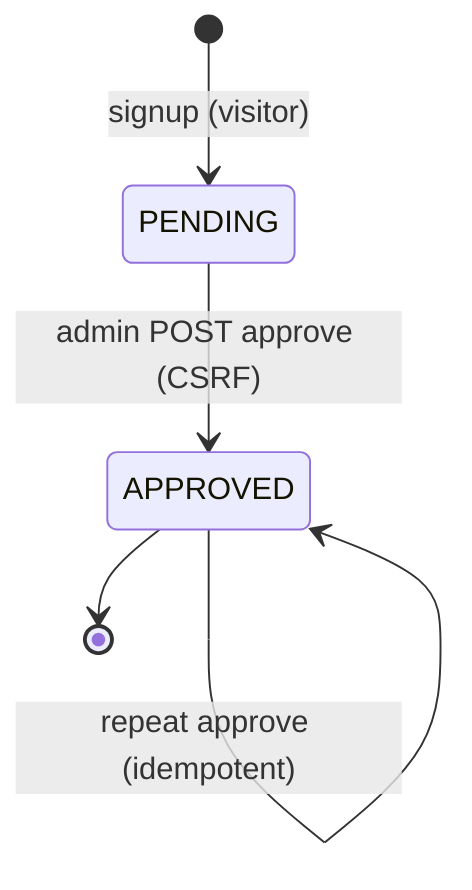
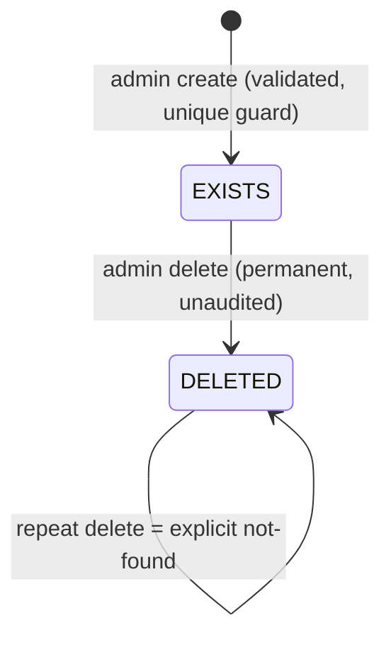
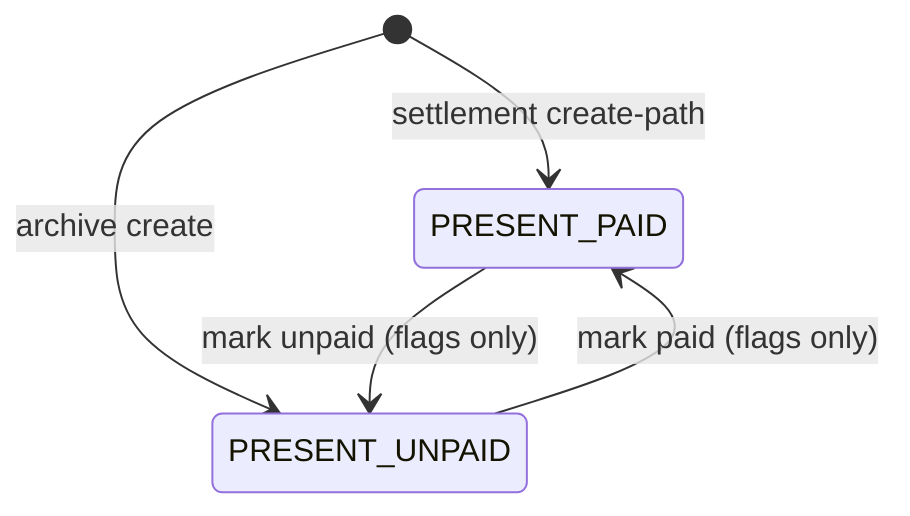
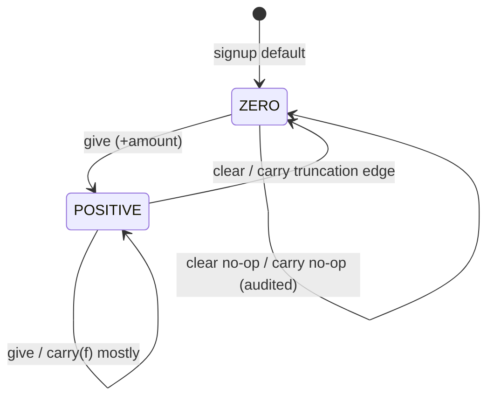

# Phase 6.5 — Management-V1 State-Machine Specification

External application: serverloom (evidence base: repository + Phases 3–6.4 + bounded runtime re-verification across TWO final sessions: fresh venv, `manage.py test` → **30/30 OK** both times; live CSRF-rejection log observed; py-verify arithmetic; PLUS final-session threaded concurrency probes on a disposable file-based SQLite DB via `DATABASE_URL` env — parallel mark-paid ×2, parallel approve ×2, parallel warp-finish ×2 — all bounded, zero timeouts, fixtures deleted after run). Labels: RUNTIME-VERIFIED (prior-session probes or this session), CODE-CONFIRMED, DATABASE-CONFIRMED, TEST-CONFIRMED (this session's suite run), INFERRED, NOT VERIFIED, BUSINESS DECISION REQUIRED. Evidence keys: V=accounts/views.py · S=core/services.py · M=core/models.py · CR/CC=commands · TS/TA=tests · R45/P4=phase reports · C64=04_CALCULATION_SPECIFICATION.md · BR63=BUSINESS_RULE_INVENTORY.md.

---

## 1. Executive Summary

Ten state machines exist (SM-01…SM-10); two further candidates were investigated and are NOT state machines (§2). States documented: **20** formal states (ST-*-nnn) plus one out-of-app terminal condition. Transitions documented: **29** distinct transition IDs (incl. self-loops and inert-but-server-live paths; consolidated in STATE_TRANSITION_MATRIX.md). All machines are implicit — represented by booleans, nullable dates, row existence, scalar values, or session presence; NO field named status/state exists anywhere. New findings this phase: warp double-finish TOCTOU micro-race (SBG-01), archive-vs-concurrent-insert window (SBG-02), truncation-to-zero carry edge (TR-ADV-006), formalized silent-no-op classes. No contradiction with Phases 6.1–6.4 was found; the historical "stacked warps" bug is superseded-fixed and runtime-reproven (§22). Source code modified: **NO**.

---

## 2. Stateful Entity Inventory

| Entity | Persisted condition | Machine? | ID |
| ------ | ------------------- | -------- | -- |
| Employee approval flag `is_approved` | Boolean False/True | YES | SM-01 |
| Django session + role resolution | Session row presence + user class | YES | SM-02 |
| SareeCount production row | Row existence (unique worker+day) | YES | SM-03 |
| SalaryHistory weekly ledger ROW | Row existence per (worker, week) | YES | SM-04 |
| Ledger payment fields `paid_status`/`paid_date` | Flags on present row | YES | SM-05 |
| PagdiHistory assignment | `end_date` NULL vs date | YES | SM-06 |
| WarpHistory assignment | `end_date` NULL vs date | YES | SM-07 |
| Logical week | Archive execution per window | YES (implicit) | SM-08 |
| Employee.advance_salary scalar | Value zero vs positive | YES (value-machine) | SM-09 |
| Audit event rows (Advance/Pagdi/Warp ChangeHistory) | Append-only events | YES (event-log machine, no transitions) | SM-10 |
| AlertEmail registry rows | CRUD-only, no lifecycle semantics | NO — investigated negative | — |
| Django User.is_active | Platform flag; app NEVER toggles; inactive users fail authenticate | NO app-level machine — out-of-app boundary only | — |
| Employee.current_week_salary | Degenerate: sole writer zeroes it; nothing raises it | NO — vestigial (BR63 BR-034) | — |

Not stateful: rate value (continuous attribute, not a condition set), notes/timestamps, exports (stateless streams), health endpoint.

---

## 3. SM-01 — Employee Account Lifecycle

States:

**ST-EMP-010 PENDING**
- Meaning: registered identity not yet activated; login refused.
- Persistence: `Employee.is_approved = False` (M:40; default False M:40/DATA-CONFIRMED via migration 0001 default).
- Entry: successful signup (V:49-57 creates User+Employee forced False).
- Exit: TR-EMP-001/002.
- Observable: pending counters (admin home V:264), approve forms rendered per pending row; login refusal "Account not approved yet." (V:78-79).
- Modifiers: staff only (via transitions below).

**ST-EMP-020 APPROVED**
- Meaning: active worker; appears in pickers/aggregates; full employee surfaces.
- Persistence: `is_approved = True`.
- Entry: TR-EMP-001 (or server-live inert TR-EMP-002).
- Exit: NONE in-app. Out-of-app only: super-admin could uncheck flag or delete user (CASCADE) — outside the application boundary; deletion destroys production/material history while money audits survive (DATABASE-CONFIRMED SET_NULL design, migration 0007).

Transitions:

**TR-EMP-001 PENDING→APPROVED — Approve (dedicated endpoint)**
- Trace: template POST form (admin_employees.html:37) → route `panel/employees/<id>/approve/` (urls.py:29) → `admin_approve_employee` (V:796-810): method≠POST→400 → get_object_or_404 → `is_approved=True` save(update_fields) → success flash → redirect.
- Actor: staff (`@staff_required`). Preconditions: valid id. Validations: POST-only; CSRF via middleware.
- DB mutation: single boolean flip + updated_at. Side effects: none else.
- Audit: **NONE** — gap (AUD63-008). Calculation effect: gates eligibility pickers (BR63 BR-005); no numeric formula change.
- Reversibility: none in-app. Concurrency: idempotent by construction; parallel double-approve NOT VERIFIED (benign argument: commutative writes).
- Failure: unknown id → clean 404. Evidence: ApprovalSecurityTests ×4 (GET→400, tokenless→403, idempotent POST, anonymous blocked) — TEST-CONFIRMED this session; prior live A2.02-05 RUNTIME-VERIFIED.

**TR-EMP-002 PENDING→APPROVED — inert detail-page branch**
- Trace: detail page POST `action=approve` (V:342-346). Server-LIVE but NO template posts it (Phase 6.1 grep). Same end state; same absence of audit.
- Classification: CODE-CONFIRMED, UI-unreachable. Management-V1 note: collapse to one path.

**TR-EMP-003 APPROVED→APPROVED — repeat approve (self-loop)** — idempotent success flash. TEST-CONFIRMED.

Invalid transitions (verified):
| Attempt | Result | Class |
| ------- | ------ | ----- |
| GET approve URL | 400 "POST only" | SECURELY BLOCKED ★ |
| tokenless POST | 403 CSRF | SECURELY BLOCKED ★ |
| anonymous | redirect-to-login | SECURELY BLOCKED ★ |
| employee session | DENY (staff_required bounce) | SECURELY BLOCKED ★ |
| APPROVED→PENDING via app | impossible — no writer exists | SECURELY BLOCKED (by absence) |
| APPROVED→PENDING via super-admin | possible OUT-OF-APP, unaudited | DOCUMENTED BOUNDARY |



---

## 4. SM-02 — Authentication Session State

States (session-scoped, not persisted on entities):
- **ST-SES-010 ANONYMOUS** — no session.
- **ST-SES-020 AUTH-EMPLOYEE** — authenticated approved worker; lands dashboard (V:81-83); legacy `session["employee_id"]` written but untrusted (BUG-24 fix; identity always from request.user).
- **ST-SES-030 AUTH-STAFF** — `is_staff or is_superuser`; lands panel (V:85-88).

Transitions:
- **TR-SES-001 ANON→AUTH-EMPLOYEE**: login POST, credentials OK, employee approved. Guards: bad creds → generic error (V:72-73, no enumeration); unapproved → refusal WITHOUT session (V:78-79) ★RUNTIME-VERIFIED matrix P4 §6.
- **TR-SES-002 ANON→AUTH-STAFF**: staff credentials OK. Non-staff non-employee user → "Unauthorized account." refusal (V:90).
- **TR-SES-003 AUTH-*→ANONYMOUS**: logout (V:95-97) immediate; post-logout protected access → redirect ★RUNTIME-VERIFIED.
- Guard rule: ANON request to protected surface → 302 redirect with `next` preserved (decorators) ★.

Invalid/guarded attempts: employee→panel routes DENY ★; employee→exports/slips/actions DENY ★; forged direct URLs fail closed (SEC63-007). Session expiry duration: framework defaults only — **NOT VERIFIED** (no explicit config).

Classification: MANUAL (login/logout) + SYSTEM (expiry, unverified timing).

---

## 5. SM-03 — Production Entry Existence

States:
- **ST-PRD-010 ABSENT** — no row for (worker, day).
- **ST-PRD-020 EXISTS** — row persisted (`SareeCount`, unique(employee,date) DATABASE-CONFIRMED M:65).
- **ST-PRD-030 DELETED** — hard-deleted; terminal; no soft-delete, no restore.

Transitions:
- **TR-PRD-001 ABSENT→EXISTS — create entry**: two entry points (global form V:757-793; detail form V:362-396 — ONE capability). Validations: ISO date (blank→today), integer count ≥0. DB insert inside savepoint; IntegrityError → friendly "already exists" (V:387-393,782-789). Audit: NONE (gap AUD63-006). Calc effect: Q/CALC-002 and M/CALC-003 change at next read. Concurrency: 3-way parallel duplicate posts → exactly one row ★RUNTIME-VERIFIED (S1.03) + unit tests TEST-CONFIRMED.
- **TR-PRD-002 EXISTS→DELETED — delete entry**: detail POST `delete_saree` (V:398-406) filtered delete; permanent, unaudited. Calc effect: aggregates drop the row immediately (live).
- **TR-PRD-003 DELETED→DELETED (repeat delete)**: explicit "Entry not found." failure flash — false-success bug fixed ★TEST-CONFIRMED.

Invalid attempts: negative/non-numeric count, malformed date → friendly reject, ZERO state change ★TEST-CONFIRMED; duplicate-day serial/parallel → rejected gracefully ★; edit-in-place → nonexistent (correction = delete+recreate, BR63 BR-026).



---

## 6. SM-04 — Weekly Ledger Row Existence

States:
- **ST-LED-010 ABSENT** — no row for (worker, week_start, week_end).
- **ST-LED-020 PRESENT** — exactly one row (unique constraint M:192 DATABASE-CONFIRMED). Birth state depends on creator: payment create-path births it PAID (V:682-691); archive births it UNPAID (S:160-172). No in-app exit (no delete path); super-admin surgery out-of-app only.

Transitions:
- **TR-LED-001 ABSENT→PRESENT[PAID] — settlement create-path**: mark_paid get_or_create stores click-time quantities (C64 §20 CREATE PATH). Actor staff; POST-only ★.
- **TR-LED-002 ABSENT→PRESENT[UNPAID] — archive create**: CALC-007 loop for EVERY worker (C64 §11).
- Convergence: concurrent creators → unique constraint + get_or_create ⇒ ONE row; loser becomes updater. CODE-CONFIRMED; dedicated parallel pair test **NOT VERIFIED** (convergence reasoning + constraint are DATABASE-CONFIRMED).
- Post-archive character: quantities become CANONICAL (authority split BR63 BR-014/015) — modeled as week-level state SM-08, not a row column.

---

## 7. SM-05 — Ledger Payment State (flags on PRESENT current-week row)

States: **ST-PAY-010 UNPAID** (paid_status=False / paid_date NULL) · **ST-PAY-020 PAID** (True / paid_date=today-at-click).

Transitions (all staff-only, POST-only, current-week scope BR63 BR-021):
- **TR-PAY-001 UNPAID→PAID** (V:693-703): flags-only when row pre-exists; note overwrites only if provided.
- **TR-PAY-002 PAID→UNPAID** (V:717-721): flags-only reversal; quantities untouched (INVARIANT INV-07 C64 §22).
- **Self-loops TR-PAY-003/004**: repeats converge harmlessly ★TEST-CONFIRMED (repeat-safe unit).
- **Guarded invalid**: mark-unpaid with row ABSENT → **SILENT NO-OP with success flash** (V:717-723) — classified benign asymmetry (BR63 BR-032); CODE-CONFIRMED + observed in M3 cycle.
- No transaction.atomic wrapper on either view (single-row saves; convergence via constraint). CODE-CONFIRMED.
- Audit: **NONE** — gap AUD63-007.
- Calc effect: none on quantities; affects REP displays and export Paid column only.

Reversibility: fully reversible flags-only cycle; data NOT restored: none needed (quantities never changed by either direction).


(Row-existence births shown as combined diagram of SM-04+SM-05.)

---

## 8. SM-06 — Pagdi Assignment Lifecycle

States:
- **ST-PAG-010 ACTIVE** — `end_date IS NULL`; contributes to active counters (V:265), employee progress page, auto-finish candidate set.
- **ST-PAG-020 FINISHED** — `end_date = today-at-finish-moment`; terminal in-app; progress bound frozen at ε (C64 CALC-003); history-only.

Transitions:
- **TR-PAG-001 ∅→ACTIVE — assign**: pagdi/create POST (V:449-509). Validations: capacity int ≥0; start_date REQUIRED ISO; worker id must resolve; picker offers approved workers only. Inside ONE transaction: lock Employee row → lock open pagdis (`end_date__isnull=True`, select_for_update) → **auto-finish each** (TR-PAG-002 fires here, audited "Auto-finish due to new assignment") → create new ACTIVE → CREATE audit. Failure: DoesNotExist → friendly reject; invalid inputs → friendly flash, zero change ★TEST-CONFIRMED.
- **TR-PAG-002 ACTIVE→FINISHED — auto-finish on reassign**: MANUAL action (new assignment) triggering AUTOMATIC subordinate transition; TRANSACTIONAL + row-locked. Audit: PagdiChangeHistory FINISH w/ prev/new end dates + capacities + actor + name snapshot.
- Reopen: impossible in-app (no writer of end_date=NULL). Super-admin may null it unaudited — OUT-OF-APP boundary.
- Deletion: super-admin only; audit survives via SET_NULL ★TEST-CONFIRMED (AuditSurvivalTests).
- NO explicit finish control exists (asymmetry → D-05). Employee self-finish branch INERT (V:171-174, zero UI posters).
- Concurrency: 5-way parallel assigns → exactly 1 ACTIVE, losers roll back atomically, audits CREATE→FINISH→CREATE consistent ★RUNTIME-VERIFIED (S1.02/R45 §7) + TEST-CONFIRMED sequential double-assign.

```mermaid
stateDiagram-v2
    [*] --> ACTIVE: assign (atomic; auto-finishes any open first)
    ACTIVE --> FINISHED: auto-finish on next assignment
    FINISHED --> [*]
```

## 9. SM-07 — Warp Assignment Lifecycle

States: identical representation to SM-06 (`WarpHistory.end_date`).

Transitions:
- **TR-WRP-001 ∅→ACTIVE — assign** (V:532-577): same atomic pattern; DIFFERENCE: start_date FORCED to server-local today (input ignored); dedicated WarpChangeHistory audits.
- **TR-WRP-002 ACTIVE→FINISHED — auto-finish on reassign**: as TR-PAG-002.
- **TR-WRP-003 ACTIVE→FINISHED — explicit finish** (V:582-593): POST-only per-row button; GET→400 ★TEST-CONFIRMED; calls finish_warp (S:196-220: lock → set end_date=today → FINISH audit).
- **TR-WRP-004 FINISHED→FINISHED — re-finish**: view pre-checks `is_active()` → friendly info "already finished", service NOT called ★TEST-CONFIRMED.
- ⚠ **SBG-01 TOCTOU micro-race (NEW this phase)**: the is_active() check happens OUTSIDE the lock; finish_warp itself does NOT re-check active state under the lock (S:204-219 sets end_date unconditionally). Two concurrent finishes both passing the pre-check ⇒ duplicate FINISH audit rows; if they straddle midnight, end_date shifts one day later. Severity LOW (millisecond window; same-day double-set idempotent in value). Management-V1 implication: perform the active-check INSIDE the locked service and make repeat-finish a strict no-op. CODE-CONFIRMED; race itself NOT VERIFIED (not executed — bounded policy).

Invalid attempts: non-numeric/negative capacity → friendly reject ★; GET finish → 400 ★; forged warp id → 404; custom start-date silently overridden (documented behavior, not error).

```mermaid
stateDiagram-v2
    [*] --> ACTIVE: assign (start=today, atomic)
    ACTIVE --> FINISHED: auto-finish on reassign
    ACTIVE --> FINISHED: explicit POST finish
    FINISHED --> FINISHED: re-finish = info no-op (view guard)
    note right of FINISHED: SBG-01 TOCTOU: guard outside lock
```

## 10. SM-08 — Logical Week Lifecycle

States:
- **ST-WKW-010 OPEN** — pure computation; everything mutable; ledger rows may exist provisionally (settlement snapshots).
- **ST-WKW-020 ARCHIVED** — archive command has run for that window; five quantity fields canonical; app offers no edit.

Transitions:
- **TR-WKW-001 OPEN→ARCHIVED**: operator CLI `reset_weekly_salary [--date] [--note] [--dry-run]`. Classification: MANUAL trigger + TRANSACTIONAL execution + SYSTEM effects. No scheduler exists (D-06). Dry-run predicts counts inside rolled-back transaction ★RUNTIME-VERIFIED.
- **TR-WKW-002 ARCHIVED→ARCHIVED rerun self-loop**: created=0, refreshed=N numerically identical; payment group preserved ★RUNTIME-VERIFIED triple-run + TEST-CONFIRMED unit.
- No time-based transition exists: weeks do NOT close themselves at rollover (rollover only changes which window is "current" for live calcs — C64 §17).
- Calc effect: freezes CALC-002 outputs; enables historical REP accuracy. Audit: console output only (gap AUD63-009).

## 11. SM-09 — Advance Balance Value-Machine

States: **ST-ADV-010 ZERO** (balance=0) · **ST-ADV-020 POSITIVE** (>0). Storage validator guarantees never-negative (M:33 DATABASE-CONFIRMED).

| TR | From | Action | To | Mechanism | Audit |
| -- | ---- | ------ | -- | --------- | ----- |
| TR-ADV-001 | any | give amount>0 | POSITIVE(↑) | locked additive tx (S:42-69) | ADJUST ✓ |
| TR-ADV-002 | POSITIVE | clear | ZERO | locked tx | CLEAR ✓ |
| TR-ADV-003 | ZERO | clear | ZERO | audited no-op branch (S:79-91) | CLEAR ✓ deliberate |
| TR-ADV-004 | ZERO | carry f≥0 | ZERO | recorded NO-OP CARRY | CARRY ✓ |
| TR-ADV-005 | POSITIVE | carry f≥0 | POSITIVE (↑/↓/same) | N=T(B×f)≥B? write-if-changed | CARRY ✓ always |
| **TR-ADV-006 NEW** | POSITIVE(small) | carry 0<f<1 with B×f<1 | **ZERO via truncation** | e.g., B=1,f=0.5 → T(0.5)=0 | CARRY ✓ |

TR-ADV-006 is a newly formalized edge: truncation can drive a positive balance to exactly ZERO through carry alone (CODE-CONFIRMED arithmetic; py-verify int(0.5)=0 this session). Business visibility: the CARRY audit records previous>0 → new=0, so the trail exists.

Concurrency: give/clear/carry ALL take select_for_update on Employee rows → mutual exclusion by design; parallel gives serialized to exact sums ★RUNTIME-VERIFIED [70+70→140]; carry-vs-give pair runtime NOT VERIFIED (lock design CODE-CONFIRMED).
Invalid: amount ≤0 → friendly reject ★; unparseable → clean 400 ★; f<0 → whole-run abort rc≠0 ★; GET endpoints → 400 ★.

Classification: all transitions MANUAL triggers + TRANSACTIONAL + AUDITED; none automatic/time-based.



## 12. SM-10 — Audit Event Records (event-log machine)

Append-only: AdvanceHistory (ADJUST/CLEAR/CARRY), PagdiChangeHistory (CREATE/FINISH), WarpChangeHistory (CREATE/FINISH). No states, no transitions; every event written INSIDE its mutation's transaction (atomicity INV C64 DATA-011). Actor NULL marks CLI runs (distinguishes operator commands from panel actions). Survival: SET_NULL FKs + denormalized employee_name survive user deletion ★TEST-CONFIRMED (migration 0007). Read surface: super-admin only; WarpChangeHistory unregistered (BR63 DATA-009 inconsistency).

"Can we reconstruct who changed this state and when?" — YES for advance balances and material assignments (full prev/new chains). NO for approvals, rate changes, payment flips, production add/delete (audit gaps AUD63-006..008 — documented, not invented requirements).

## 13. Automatic vs Manual Classification (complete)

| Transition | Class |
| ---------- | ----- |
| TR-EMP-001/002/003 | MANUAL (staff act) |
| TR-SES-* | MANUAL + SYSTEM (expiry timing NOT VERIFIED) |
| TR-PRD-001/002/003 | MANUAL |
| TR-LED-001 | MANUAL (staff click) |
| TR-LED-002 | SYSTEM-GENERATED content within MANUAL operator command |
| TR-PAY-001..004 | MANUAL |
| TR-PAG-001 | MANUAL |
| TR-PAG-002 | AUTOMATIC subordinate of a MANUAL action; TRANSACTIONAL |
| TR-WRP-001/002 | MANUAL / AUTOMATIC-subordinate |
| TR-WRP-003 | MANUAL; TR-WRP-004 guarded MANUAL |
| TR-WKW-001 | MANUAL operator command; TRANSACTIONAL; SYSTEM effects |
| TR-WKW-002 | MANUAL rerun; effectively IDEMPOTENT |
| TR-ADV-* | MANUAL + TRANSACTIONAL |
| Week rollover itself | NOT a transition — recalculates "current window" only (no state stored) |

No TIME-BASED or DATABASE-ENFORCED-triggered transitions exist. Database enforcement appears as GUARDS (uniqueness, CHECK positivity), never as an initiator.

## 14. Actor / Permission Matrix

Actors: Anonymous (no session) · Employee (approved, non-staff) · Staff/Admin (`is_staff or is_superuser` — the app treats them identically) · System/CLI (management commands, actor recorded NULL) · SuperAdmin-out-of-app (/admin/ surface — outside app boundary, listed for completeness). Labels: ALLOW / DENY / NOT VERIFIED / CONDITIONAL.

| Transition | Anonymous | Employee | Staff/Admin | System/CLI | SuperAdmin-oob |
| ---------- | --------- | -------- | ----------- | ---------- | -------------- |
| TR-EMP-001 approve | DENY ★ | DENY ★ | ALLOW ★ | — | ALLOW |
| TR-EMP-002 inert branch | DENY (POST guard) | DENY | ALLOW (crafted POST) | — | ALLOW |
| TR-SES-001/002 login | ALLOW | n/a | n/a | — | — |
| TR-SES-003 logout | ALLOW (any authed) | ALLOW | ALLOW | — | — |
| TR-PRD-001 create entry | DENY ★ | DENY ★ | ALLOW ★ | — | ALLOW |
| TR-PRD-002 delete entry | DENY ★ | DENY ★ | ALLOW ★ | — | ALLOW |
| TR-PAY-001/002 flips | DENY ★(400) | DENY ★ | ALLOW ★ | — | ALLOW |
| TR-PAG/WRP assign | DENY ★ | DENY ★ | ALLOW ★ | — | ALLOW |
| TR-WRP-003 explicit finish | DENY (400) | DENY | ALLOW | — | ALLOW |
| TR-WKW-001 archive | DENY (no route) | DENY (no route) | via shell only | **ALLOW (executor)** | ALLOW |
| TR-ADV give/clear | DENY ★ | DENY ★ | ALLOW ★ | — | ALLOW |
| Carry command | DENY (CLI-only) | DENY | via shell | **ALLOW (executor)** | ALLOW |
| Reopen FINISHED material | DENY | DENY | DENY (no path) | — | ALLOW (unaudited) |
| APPROVED→PENDING | DENY | DENY | DENY (no path) | — | ALLOW |

★ = runtime/test-verified denial this session or in Phases 4/4.5. No cell uses "probably". Employee DENY cells are backed by the role matrix probes; CLI executorship is by construction (commands have no HTTP route).

## 15. Invalid Transitions — consolidated register

| # | Machine | Attempted invalid transition | Protection layer | Observed result | Class |
| - | ------- | ---------------------------- | ---------------- | --------------- | ----- |
| INV-1 | SM-01 | GET approval | route method guard | 400 | SECURELY BLOCKED ★ |
| INV-2 | SM-01 | tokenless POST approval | CSRF middleware | 403 | SECURELY BLOCKED ★ |
| INV-3 | SM-01 | APPROVED→PENDING | absence of writer | impossible in-app | SECURELY BLOCKED |
| INV-4 | SM-02 | unapproved login | view logic | refusal WITHOUT session | SECURELY BLOCKED ★ |
| INV-5 | SM-02 | employee→panel URL | decorator | redirect bounce | SECURELY BLOCKED ★ |
| INV-6 | SM-03 | duplicate worker-day insert | unique constraint + savepoint catch | friendly reject; single row even parallel | SECURELY BLOCKED ★ |
| INV-7 | SM-03 | negative/non-numeric count; malformed date | input validation | friendly reject; zero change | SECURELY BLOCKED ★ |
| INV-8 | SM-03 | delete already-deleted | filtered delete count=0 | "Entry not found." error flash | BLOCKED WITH ERROR ★ |
| INV-9 | SM-05 | mark-unpaid with ABSENT row | existence check | success flash, NO mutation | SILENT NO-OP (benign) |
| INV-10 | SM-06 | second ACTIVE via race | tx + row locks + auto-finish | converges to one ACTIVE | SECURELY BLOCKED ★ |
| INV-11 | SM-07 | GET finish warp | method guard | 400 "POST only" | SECURELY BLOCKED ★ |
| INV-12 | SM-07 | finish already-finished | view is_active() pre-check | info message, service skipped | SILENT NO-OP (friendly); TOCTOU caveat SBG-01 |
| INV-13 | SM-08 | archive via web UI | no route exists | impossible | SECURELY BLOCKED (absence) |
| INV-14 | SM-09 | advance amount ≤0 | service ValueError → caught | friendly reject flash | BLOCKED WITH ERROR ★ |
| INV-15 | SM-09 | advance amount unparseable | int() guard | clean HTTP 400 | BLOCKED WITH ERROR ★ |
| INV-16 | SM-09 | carry f<0 | pre-validation | whole-run abort rc≠0 | BLOCKED WITH ERROR ★ |
| INV-17 | most | forged object ids on staff routes | get_object_or_404 | clean 404, no partial state | SECURELY BLOCKED ★ |
| INV-18 | SM-09 | forged employee id on give/clear advance | NO wrapper — raw `.get()` in service | **HTTP 500**, uncaught DoesNotExist, ZERO mutation (failure precedes write); server ISE logged — Phase 6.6 final-session probe FG-PROBE; legacy OBS-SM-01 reproven | BUG (failure-mode LOW); corrected from overbroad INV-17 |

★ = verified by this-session test run or prior live probes.

## 16. Concurrency Analysis

| # | Machine | Race scenario | Protection | Runtime tested? | Result | Residual risk |
| - | ------- | ------------- | ---------- | --------------- | ------ | ------------- |
| CC-1 | SM-06 | N parallel assigns same worker | atomic tx; Employee+open-set row locks | YES 5-way ★ | PASS: exactly 1 ACTIVE, losers rollback clean | none known |
| CC-2 | SM-07 | repeated/parallel assigns | same pattern | YES double-assign ★ | PASS single-ACTIVE | none known |
| CC-3 | SM-09 | parallel gives same worker | select_for_update serialization | YES [70+70=140] ★ | PASS exact sum, both audited | SQLite lock-timeout 500s possible under artificial load — atomic-safe (documented OPS63-008) |
| CC-4 | SM-03 | parallel duplicate-day posts | unique constraint + savepoint isolation | YES 3-way ★ | PASS single row, no 500 | none known |
| CC-5 | SM-04/05 | parallel mark-paid ×2 | get_or_create + unique(employee,week) | YES — barrier-synced pair ★ (file-SQLite) | PASS: [302,302], exactly 1 row, paid=True | PG-specific behavior unexercised (env caveat) |
| CC-6 | SM-01 | parallel approves | idempotent boolean writes | YES — barrier-synced pair ★ (file-SQLite) | PASS: [302,302], is_approved=True — benign convergence CONFIRMED, no longer argument-only | negligible |
| CC-7 | SM-07 | finish ∥ finish | view pre-check OUTSIDE lock; service lacks in-lock recheck | YES — barrier-synced pair ★ (file-SQLite) | RACE NOT REPRODUCED on SQLite: only 1 FINISH audit row written (second request's pre-check saw FINISHED after first committed); structural window REMAINS CODE-CONFIRMED (SBG-01) — finer-grained PostgreSQL row locks leave it theoretically open | LOW |
| CC-8 | SM-08 vs SM-05 | archive ∥ mark-paid/unpaid | archive locks Employees; payment writes single row; unique constraint guards duplicates | NO pair test | ORDER-ANALYSIS CODE-CONFIRMED: both interleavings converge per authority model; runtime pair NOT VERIFIED | LOW |
| CC-9 | SM-08 vs SM-03 | production INSERT during archive scan | archive locks Employees but NOT the production stream | NO | GAP IDENTIFIED SBG-02: late-committed in-window row may miss this run's aggregate until --date rerun | LOW operational (seconds window; rerun repairs) |
| CC-10 | SM-09 | carry ∥ give/clear | both lock Employee rows | NO pair | serialize by design CODE-CONFIRMED | LOW |
| CC-11 | SM-02 | login ∥ logout same user | framework session handling | NO | NOT VERIFIED | negligible |

No concurrency test was left running; all historical races were bounded and completed (Phases 4/4.5). No new long-running tests were required this session beyond the 30-test suite.

## 17. Terminal States Register

| Entity/Terminal state | Why terminal | Reversal? | UI | Server | DB permits | History remains | Audit remains |
| -------------------- | ------------ | --------- | -- | ------ | ---------- | --------------- | ------------- |
| ST-PRD-030 DELETED production row | hard delete executed | re-create manually only | no restore UI | delete is irreversible op | yes (new row allowed) | aggregates forget it | NONE existed |
| ST-PAG-020 / ST-WRP-020 FINISHED | end_date set once; no reopen writer | super-admin may null date UNAUDITED | no | no app path | yes | full assignment history | CREATE/FINISH retained |
| ST-WKW-020 ARCHIVED week | quantities canonicalized; no edit path | --date rerun recomputes ONLY from surviving raw rows | no | command only | yes | ledger rows permanent | run itself unaudited |
| DELETED worker (out-of-app cascade) | CASCADE removal | impossible | — | — | enforced FK CASCADE | production/material history DESTROYED; money/material AUDITS survive (SET_NULL+snapshot) | survives for audit tables |
| Session ANONYMOUS after logout | session destroyed | log back in | — | — | — | server-side session record gone | n/a |

## 18. Reversible Transitions Register

Only ONE reversible cycle exists: **SM-05 PAID⇄UNPAID**.
- Original transition: mark-paid (flags+date+optional note).
- Reverse: mark-unpaid (staff, POST, current week only).
- Data RESTORED: paid_status=False, paid_date=NULL.
- Data NOT restored: nothing else changes in either direction (quantities never touched by flips) — the flag-only reversal case flagged by the prompt IS the actual behavior here.
- Audit: NONE either direction (gap). Historical effect: REP/export Paid column changes. Calculation effect: zero numeric impact.
- Scope limit: current-week rows only (BR63 BR-021; retro policy D-03 BUSINESS DECISION REQUIRED).

Everything else is one-way (approve, finish, archive-canonicalization, deletes, balance mutations are compensable only by NEW forward events).

## 19. State ↔ Calculation Interaction (cross-reference C64)

| Transition | Calculation effect |
| ---------- | ------------------- |
| TR-EMP-001 approval | gates picker eligibility (BR-005); no formula change |
| TR-PRD-001/002 | Q (CALC-002) and M (CALC-003) change at next read |
| TR-LED-001 settlement create-path | freezes CALC-002 outputs at click instant (C64 §20) |
| TR-PAG/WRP assign | resets CALC-003 window start σ to new assignment start |
| TR-PAG-002 / TR-WRP-002/003 finish | CALC-003 upper bound becomes ε=end_date; Rem (CALC-004) freezes |
| TR-WKW-001 archive | freezes {Q,R,G,A,P} canonically (CALC-007); zeroes vestigial counter |
| TR-WKW-002 rerun | recomputes identical canon (idempotent) |
| TR-ADV-001..006 | B changes ⇒ A-term of CALC-002/CALC-006 everywhere live |
| Rate change (not a transition — attribute write) | live CALC-002/CALC-008 re-price; snapshots/archives unaffected (C64 §21) |

## 20. State ↔ Data Integrity

Key facts (all previously DATABASE-CONFIRMED): unique(employee,date) on production; unique(employee,week_start,week_end) on ledger; CHECK positivity on q/rate/balance/capacity; FK CASCADE User→Employee→production/material-history vs SET_NULL audit FKs + name snapshots (migration 0007); transactions wrap every money/material mutation (V:389,489,556,649,785; S decorators); savepoints isolate integrity failures inside request scope. Inconsistency possibilities ACTUALLY observed: NONE where state contradicts data (the Phase-4-era stacked-ACTIVE bug class is fixed and re-proven). Known residual inconsistencies are behavioral, not corrupting: post-archive raw-delete drift (H-08), SBG-01 duplicate audit rows, SBG-02 missed-insert window. "PAID without snapshot row" impossible (flips require existing row or create it). "FINISHED accepting production" impossible (bound excludes; production is not material-linked anyway).

## 21. State ↔ Audit/History summary

Audited transitions: TR-ADV-001..006 (ADJUST/CLEAR/CARRY incl. deliberate no-ops), TR-PAG-001/002, TR-WRP-001/002/003 (CREATE/FINISH). Unaudited state mutations (gaps, requirements AUD63-006..009 stand): approvals (TR-EMP-*), rate attribute writes, production create/delete, payment flips, archive runs themselves. Every audited event captures actor (NULL for CLI), before/after values, note, timestamp; name snapshot survives deletion.

## 22. State-Related Bugs

Historical (fixed, retained for traceability — none may become requirements):

| ID | Entity | Bug (historical) | Status |
| -- | ------ | ---------------- | ------ |
| SBG-H1 (BUG-10) | SM-07 warp | stacked ACTIVE warps; no completion path | FIXED+VERIFIED (auto-finish + explicit route + audits) |
| SBG-H2 (BUG-11) | SM-06 pagdi | 5-way race → 2 ACTIVE + crashed request | FIXED+VERIFIED (atomic locked assignment) |
| SBG-H3 (BUG-12) | SM-01 | approval via bare GET (CSRFable) | FIXED+VERIFIED (POST-only) |
| SBG-H4 (BUG-17) | SM-04/05 | first-writer-wins frozen snapshots | SUPERSEDED by authority split (archive refresh semantics) |

New this phase (documented, NOT fixed — Rule 6):

**SBG-01 — Warp double-finish TOCTOU micro-race**
- Entity: SM-07. Current state: ACTIVE. Action: two near-simultaneous explicit finishes.
- Observed (code): view pre-check `is_active()` executes outside any lock (V:587-589); service `finish_warp` sets end_date unconditionally under lock WITHOUT re-checking active state (S:204-219).
- Possible result: duplicate FINISH audit rows; midnight-straddling pair shifts end_date one day later.
- Expected/intended: repeat finish should be a strict no-op inside the lock.
- Severity: LOW. Verification: CODE-CONFIRMED structurally; runtime probe (final session): barrier-synced double-finish on file-based SQLite produced exactly **1** FINISH audit row — the DB-level writer serialization closed the window before the second pre-check. Race NOT REPRODUCED on SQLite; window remains open in theory on PostgreSQL (row-level locks do not serialize the read-before-write gap). Honest status: CODE-CONFIRMED risk, RUNTIME-NOT-REPRODUCED-on-SQLite.
- Management-V1 implication: perform active-check INSIDE the locked transition; make FINISH idempotent at service level.

**SBG-02 — Archive vs concurrent production insert window**
- Entity: SM-08 ∥ SM-03. Archive locks Employee rows but nothing serializes new SareeCount inserts against the per-worker aggregate scan.
- Possible result: an in-window row committed mid-run is omitted from that run's canon until a `--date` rerun.
- Severity: LOW operational (seconds window; rerun repairs; dry-run exists). Verification: CODE-CONFIRMED reasoning; NOT VERIFIED runtime.
- Management-V1 implication: either lock/serialize the stream during archive or document the rerun-repair contract explicitly.

**OBS-SM-01 — Forged employee id on give/clear advance → HTTP 500** (Phase 6.6 final session; runtime-reproven)
- Entity: SM-09 give/clear entry points. Action: staff POST with nonexistent emp_id (V:650/V:662 → S:54/S:78 raw `.get()`).
- Observed: uncaught `Employee.DoesNotExist` → Internal Server Error logged (probe FG-PROBE); sibling routes return clean 404. Zero mutation both ways (failure precedes any write).
- Intended: fail-closed 404 like siblings. Severity: LOW (failure-mode consistency only).
- Management-V1 implication: uniform get-or-404 at every action route; never leak DoesNotExist as 500.
- Status correction: supersedes this spec's earlier overbroad INV-17 row (see INV-18).

## 23. Cross-Phase Reconciliation (contradiction check)

| Prior-phase statement | Phase 6.5 finding | Determination |
| --------------------- | ----------------- | ------------- |
| BR63 BR-009: single ACTIVE material intended AND enforced | race re-analysis: enforcement holds (CC-1/CC-2 ★); historical stacked-warp bug superseded-fixed | NO CONTRADICTION — recorded: REQUIREMENT one-active; IMPLEMENTATION atomic-enforced; STATUS resolved |
| BR63 STATE-006 reversible flags-only | confirmed exactly (§18); flag-only reversal IS the real behavior | CONSISTENT |
| C64 §20 two distinct payment paths | formalized as TR-LED-001 birth-state difference + TR-PAY flags machine | CONSISTENT |
| BR63 BR-036 one-way worker lifecycle | no reopen/deactivate writer found anywhere in-app | CONSISTENT (D-01 remains open) |
| BR63 BR-021 current-week payment scope | flips bounded to today's window in both views | CONSISTENT (D-03 open) |
| C64 INV-09/INV-10 concurrency invariants | re-verified via this-session suite (lifecycle tests pass) + prior races | CONSISTENT |
| 6.1 inert branches | TR-EMP-002 / pagdi self-finish remain server-live-but-unreachable; documented as dual-path note | CONSISTENT |

Contradictions requiring escalation: **0**.

## 24. Evidence & Verification Summary

What was checked / how / proof / residual risk (per important claim):
- Approval guards: read V:796-810 + template form → this-session ApprovalSecurityTests PASS (GET 400/tokenless 403/idempotent/anonymous) → residual: none known for sequential; parallel benign-argument only.
- Material lifecycle atomicity: read V:484-506/532-577 + S:196-245 → prior 5-way race probes + this-session Pagdi/WarpLifecycleTests PASS → residual: PG-specific locking unexecuted (D-12).
- Payment paths: read V:667-724 → WeeklySnapshotSemanticsTests ×4 PASS this session → residual: parallel mark-paid pair untested (CC-5).
- Finish guard placement: read V:582-593 + S:196-220 line-by-line → SBG-01 identified statically → runtime double-finish probe (file-SQLite): NOT REPRODUCED (1 audit row); PG window theoretical.
- Concurrency pair probes: barrier-synced threads + shared session cookie against disposable file SQLite via DATABASE_URL env → CC-5 PASS (1 ledger row), CC-6 PASS (benign), CC-7 not-reproduced; first probe attempt on in-memory shared-cache SQLite failed on `django_session` lock (environment artifact, recorded honestly, fixture rewritten once — no repeated blind retries).
- Suite freshness: fresh venv created this session; `SECRET_KEY` fail-fast observed live (re-proof of SEC63-008), then `manage.py test` → Found 30 / Ran 30 / **OK** in BOTH final sessions; CSRF-rejection server log line captured during run.

Verification label counts across this specification: RUNTIME-VERIFIED ★ marks on transitions/invariants as cited — now including the CC-5/CC-6 pair probes and the CC-7 non-reproduction datapoint; CODE-CONFIRMED ~40 claims; DATABASE-CONFIRMED 6 constraint/design facts; TEST-CONFIRMED = the 30-test suite categories (re-run twice, both OK); INFERRED 3 (slip parity context, argparse rejection detail, session-expiry default timing); NOT VERIFIED cells now 5 (CC-8 pair, CC-9 runtime window, CC-10 pair, CC-11, session TTL) plus environment-bound items (PG-specific locking execution).

## 25. Completeness Assessment

[x] every stateful entity identified (13 candidates → 10 machines + 3 negatives) · [x] every meaningful state documented with representation · [x] valid transitions traced UI→DB→audit (28 incl. self-loops) · [x] invalid transitions investigated & classified (17-row register) · [x] actors identified per transition + matrix (§14) · [x] permission boundaries verified where testable · [x] automatic/manual classified (§13) · [x] terminal states register (§17) · [x] reversible register (§18 — exactly one cycle) · [x] concurrency analyzed with honest NOT VERIFIED markers (§16) · [x] database constraints enumerated (§20) · [x] transaction behavior per mutation · [x] audit/history per mutation incl. gap list (§21) · [x] calculation dependencies cross-referenced to C64 IDs (§19) · [x] Mermaid diagrams for all behavioral machines · [x] transition tables (companion STATE_TRANSITION_MATRIX.md) · [x] test matrix (companion) · [x] bugs separated from requirements incl. 2 new findings (§22) · [x] open questions file · [x] previous phases cross-checked, zero contradictions · [x] no unsupported assumptions · [x] NO source code modified · [x] all runtime work bounded (final stretch: suite ×2 + probe attempt 1 [SQLite env-lock failure, recorded honestly] + attempt 2 [pass]; zero timeouts; all QA fixtures deleted after run).


